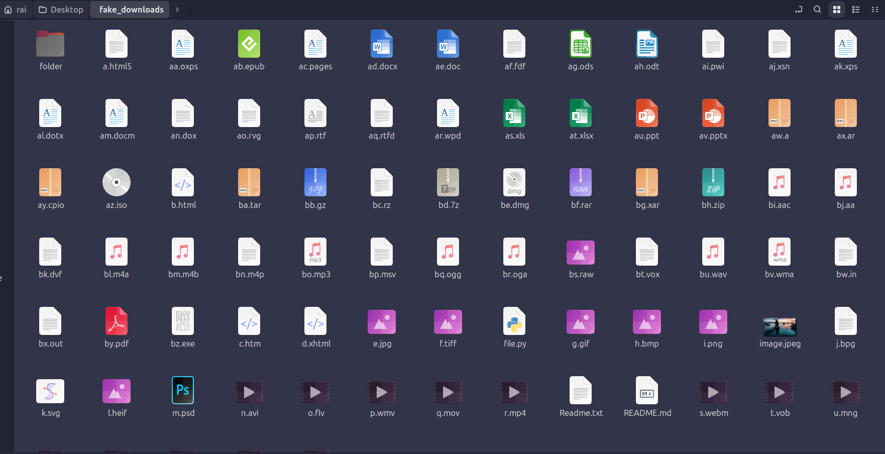
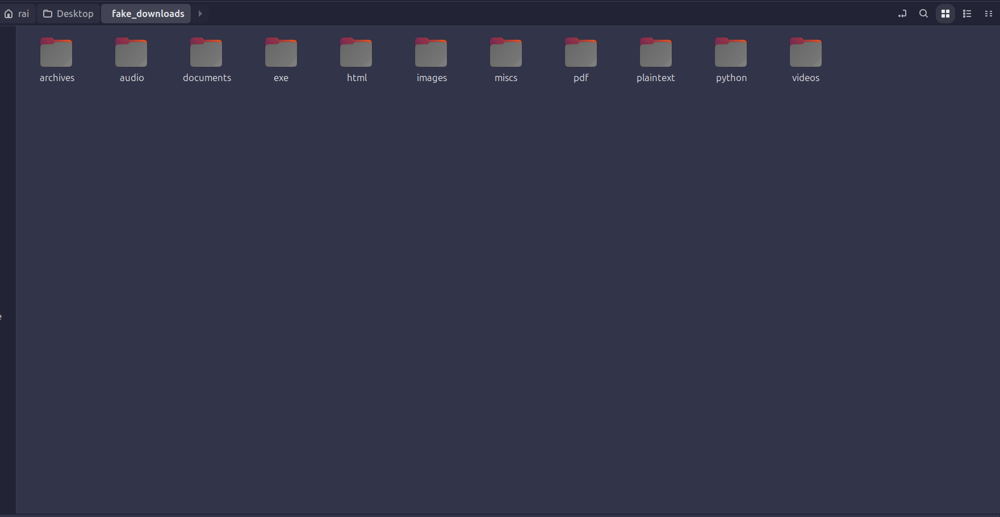

# Downloads folder organizer[Alpha-stage]

### What is it?
This is a downloads folder organizer made in python!
it sorts the given folder into different folders with respect to the extensions of the files in it. If they dont have an extension they go into the miscs folder.

**Developer's note**  :  Everything looks fine i just feel like testing a bit more before releasing it, but that will take some time.....So use it cautiously on your own risk

### Example:
`Before:`

`After`

### How to use?
You need to change the `DOWNLOADS_DIR` in settings.py and point it to your downloads directory.

### How to make custom folder and add/remove extensions?

You can change it in the `src/settings.py` file
- if u want to add more extensions just add the extensions in `DIRECTORIES` and group them into the folder you want.
- if you want to add a new custom folder just change in `DIRECTORIES` and the required extensions in it.

### Why i made it:

I didnt like how my downloads folder looked, so i made this project `¯\_(ツ)_/¯`  
Also this is probably my first automation `:)`

